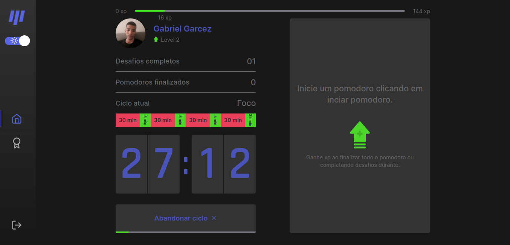

<h1 align="center">
  
</h1>

<p align="center">
  
</p>

<p align="center">
  <a href="https://move-it-five.vercel.app">Acessar site</a>
</p>

## Sobre o Projeto

Aplicação desenvolvida incialmente na NLW #04 da Rocketseat e que foi incrementado por mim para meu portfolio pessoal.

A ideia do app é aplicar a tecnica de pomodoro trazendo um sistema de gamificação, no qual o usuário vai completando os ciclos/desafios e recebendo experiência por isso.

## Funcionalidades

- Login social com Github

- Ciclo de pomodoro
  - No 1º acesso o usuário recebe um modal solicitando o tempo de foco e descanso de cada ciclo.
  <p align="center">
    
  </p>
  - Ao final do pomodoro o usuário recebe experiência.
  <p align="center">
    
  </p>
  - Caso complete o desafio, recebe experiência pelo desafio.
  <p align="center">
    
  </p>

- Ranking
  - Página de Leaderboard contendo o ranking por experiência de cada usuário registrado.

- Troca de temas
  - Opção de tema light ou dark.

## Feito com:
- [ReactJS](https://github.com/facebook/react) - Biblioteca Javascript para construção de interfaces.
- [Next.js](https://github.com/vercel/next.js) - Framework React JS.
- [Typescript](https://github.com/microsoft/TypeScript) - Supertset para o Javascript.
- [FaunaDB](https://fauna.com/) - Banco de dados.
- [Next-auth](https://github.com/nextauthjs/next-auth) - Sistema de autenticação para Next.js.
- [Context-Api](https://pt-br.reactjs.org/docs/context.html) - Gerenciamento de estado.
- [Styled-Components](https://github.com/styled-components/styled-components) - Biblioteca de estilização
- [React-modal](https://github.com/reactjs/react-modal) - Biblioteca para construção de modal.
- [React-switch](https://github.com/markusenglund/react-switch) - Biblioteca para construção do botão de switch.
- [React-hook-form](https://github.com/react-hook-form/react-hook-form) - Biblioteca para forulários.

## Como executar

- Clone do repositório
```
$ git clone https://github.com/Garcez17/Move-It

$ cd Move-It
```
- Instale as dependências
```
$ yarn

ou

$ npm install
```

## Licença

Esse projeto está sob a licença MIT. Veja o arquivo [LICENSE](https://github.com/Garcez17/Move-It/blob/main/LICENSE) para mais detalhes.